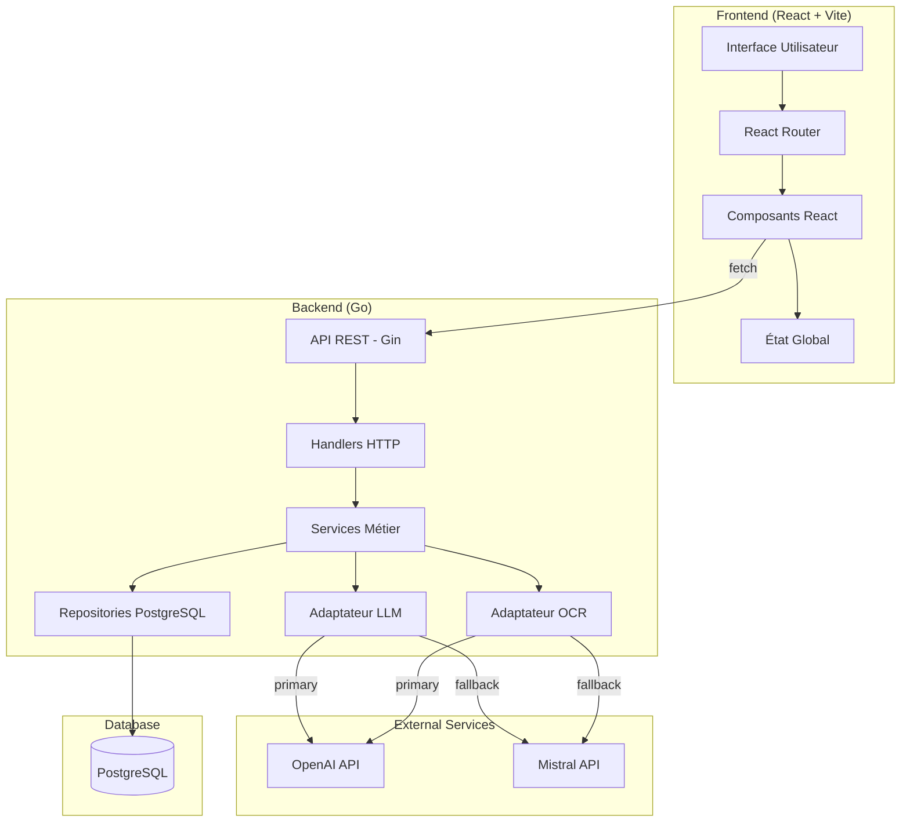
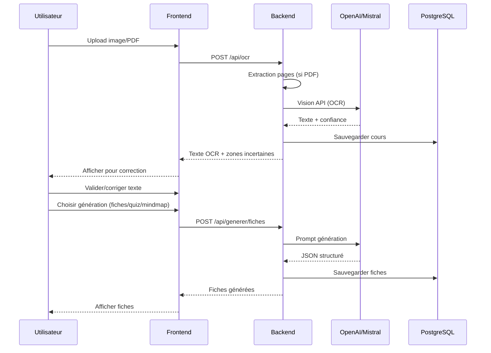
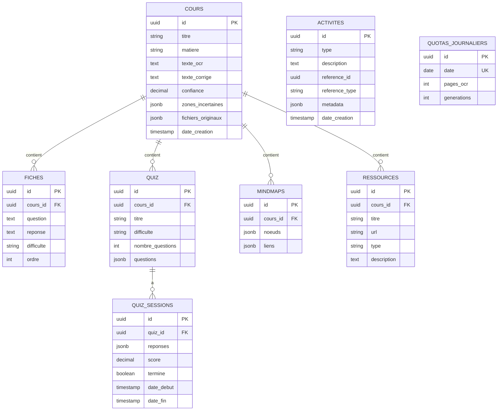
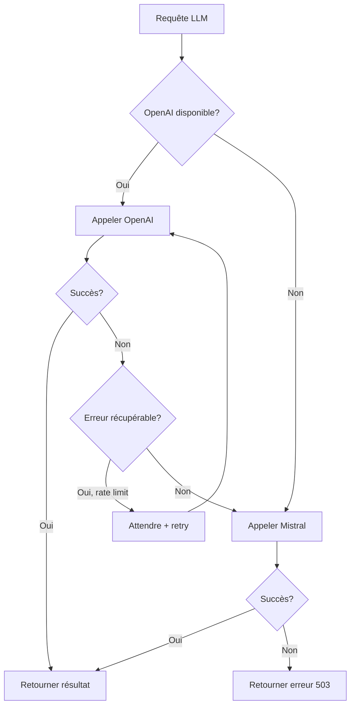

# Design Détaillé - Révise mieux MVP

## 1. Vue d'ensemble

### 1.1 Objectif
Développer la première version MVP de Révise mieux, un assistant d'étude alimenté par l'IA pour les collégiens et lycéens. Cette version :
- Tourne entièrement en local via Docker Compose
- Ne nécessite pas d'authentification (mode anonyme)
- Implémente toutes les fonctionnalités P0 du PRD

### 1.2 Fonctionnalités principales
1. **OCR de cours** : Scanner des notes manuscrites ou imprimées
2. **Génération de fiches** : Créer des fiches de révision structurées
3. **Quiz interactifs** : Générer des QCM configurables
4. **Mindmaps** : Visualiser le cours sous forme de carte mentale interactive
5. **Enrichissement** : Suggérer des ressources complémentaires
6. **Dashboard** : Tableau de bord avec statistiques et historique

### 1.3 Stack technique

| Composant | Technologie |
|-----------|-------------|
| Backend | Go 1.21+ avec Gin |
| Frontend | React 18 + Vite + TypeScript |
| Styling | Tailwind CSS |
| Database | PostgreSQL 16 |
| LLM/OCR | OpenAI GPT-4o (primary) + Mistral (fallback) |
| Mindmaps | react-flow |
| Tests E2E | Playwright |
| Container | Docker Compose |

---

## 2. Exigences détaillées

### 2.1 OCR de cours

| Exigence | Détail |
|----------|--------|
| Formats acceptés | JPG, PNG, WebP, PDF |
| Limite pages | 10 pages maximum par upload |
| Traitement PDF | Extraction page par page côté backend |
| Score de confiance | LLM indique les zones incertaines |
| Correction manuelle | Interface d'édition avec highlighting |
| Performance | < 3 secondes par page |
| Précision cible | > 92% (imprimé), > 85% (manuscrit) |

### 2.2 Génération de fiches

| Exigence | Détail |
|----------|--------|
| Format | Question/Réponse structuré |
| Source | Basé uniquement sur le contenu OCR (source-grounded) |
| Difficulté | 3 niveaux (facile, moyen, difficile) |
| Stockage | PostgreSQL avec lien vers le cours source |
| Édition | Possibilité de modifier après génération |

### 2.3 Quiz interactifs

| Exigence | Détail |
|----------|--------|
| Type | QCM (4 choix par question) |
| Nombre questions | Configurable : 5, 10, 15, 20 |
| Difficulté | Configurable : Facile, Moyen, Difficile |
| Feedback | Explication après chaque réponse |
| Score | Affiché en fin de quiz avec détail |
| Historique | Sessions sauvegardées en base |

### 2.4 Mindmaps

| Exigence | Détail |
|----------|--------|
| Visualisation | react-flow (interactive) |
| Fonctionnalités | Zoom, pan, collapse/expand |
| Export | PNG/SVG |
| Structure | JSON généré par le LLM |

### 2.5 Enrichissement de contenu

| Exigence | Détail |
|----------|--------|
| Source | Suggestions LLM (sans vérification) |
| Types | Vidéos YouTube, articles, sites éducatifs |
| Avertissement | Mention que les liens doivent être vérifiés |
| Stockage | Lié au cours source |

### 2.6 Dashboard

| Exigence | Détail |
|----------|--------|
| Statistiques | Cours scannés, quiz complétés, fiches créées, score moyen |
| Scope | Global (toute l'instance locale) |
| Cours récents | Liste avec progression |
| Activité | Historique des dernières actions |

### 2.7 Accessibilité (WCAG 2.1 AA)

| Fonctionnalité | Implémentation |
|----------------|----------------|
| Taille texte | 3 niveaux ajustables |
| Mode daltonien | Palette alternative |
| Contraste élevé | Mode high-contrast |
| Navigation clavier | Focus visible, tab order logique |
| ARIA | Attributs appropriés sur tous les composants |

### 2.8 Limites et quotas

| Paramètre | Variable d'environnement |
|-----------|--------------------------|
| Pages OCR/jour | `MAX_OCR_PAGES_PER_DAY` |
| Générations/jour | `MAX_GENERATIONS_PER_DAY` |
| Affichage quota | Dans l'UI (header ou settings) |

---

## 3. Architecture

### 3.1 Vue d'ensemble



### 3.2 Flux de données - OCR et génération



### 3.3 Structure des dossiers

```
revisemieux/
├── backend/
│   ├── cmd/
│   │   └── serveur/
│   │       └── main.go
│   ├── internal/
│   │   ├── api/
│   │   │   ├── handlers.go
│   │   │   ├── middleware.go
│   │   │   └── routes.go
│   │   ├── modeles/
│   │   │   ├── cours.go
│   │   │   ├── fiche.go
│   │   │   ├── quiz.go
│   │   │   └── mindmap.go
│   │   ├── services/
│   │   │   ├── ocr.go
│   │   │   ├── generation.go
│   │   │   └── statistiques.go
│   │   ├── llm/
│   │   │   ├── adaptateur.go
│   │   │   ├── openai.go
│   │   │   └── mistral.go
│   │   ├── store/
│   │   │   ├── postgres.go
│   │   │   ├── cours_repo.go
│   │   │   ├── fiches_repo.go
│   │   │   └── quiz_repo.go
│   │   └── config/
│   │       └── config.go
│   ├── migrations/
│   │   └── *.sql
│   ├── go.mod
│   └── Dockerfile
├── frontend/
│   ├── src/
│   │   ├── components/
│   │   │   ├── communs/
│   │   │   ├── cours/
│   │   │   ├── fiches/
│   │   │   ├── quiz/
│   │   │   └── mindmap/
│   │   ├── pages/
│   │   │   ├── Accueil.tsx
│   │   │   ├── Dashboard.tsx
│   │   │   ├── Scanner.tsx
│   │   │   ├── Fiches.tsx
│   │   │   ├── Quiz.tsx
│   │   │   └── Mindmap.tsx
│   │   ├── services/
│   │   │   └── api.ts
│   │   ├── hooks/
│   │   ├── contexte/
│   │   ├── types/
│   │   └── App.tsx
│   ├── package.json
│   ├── vite.config.ts
│   ├── tailwind.config.js
│   └── Dockerfile
├── docker-compose.yml
├── Makefile
└── .env.example
```

---

## 4. Composants et interfaces

### 4.1 API REST - Endpoints

#### Santé et statut
```
GET  /health                    → { "status": "ok" }
GET  /api/statut                → { "status", "database", "quotas" }
```

#### Cours
```
GET    /api/cours               → Liste des cours
POST   /api/cours               → Créer un cours (après OCR)
GET    /api/cours/{id}          → Détail d'un cours
DELETE /api/cours/{id}          → Supprimer un cours
PUT    /api/cours/{id}/texte    → Mettre à jour le texte OCR corrigé
```

#### OCR
```
POST   /api/ocr                 → Upload et traitement OCR
       Body: multipart/form-data (fichiers)
       Response: { texte, confiance, zonesIncertaines[] }
```

#### Génération
```
POST   /api/generer/fiches      → Générer des fiches
       Body: { coursId, options? }
       Response: { fiches[] }

POST   /api/generer/quiz        → Générer un quiz
       Body: { coursId, nombreQuestions, difficulte }
       Response: { quiz }

POST   /api/generer/mindmap     → Générer une mindmap
       Body: { coursId }
       Response: { noeuds[], liens[] }

POST   /api/generer/ressources  → Générer des suggestions de ressources
       Body: { coursId }
       Response: { ressources[] }
```

#### Quiz sessions
```
POST   /api/quiz/{id}/demarrer  → Démarrer une session
GET    /api/quiz/{id}/session/{sessionId} → État de la session
POST   /api/quiz/{id}/session/{sessionId}/repondre → Soumettre une réponse
POST   /api/quiz/{id}/session/{sessionId}/terminer → Terminer le quiz
```

#### Statistiques
```
GET    /api/statistiques        → Stats globales du dashboard
GET    /api/activite            → Historique des activités récentes
```

### 4.2 Interfaces Go (Adaptateurs)

```go
// internal/llm/adaptateur.go

// AdaptateurLLM définit l'interface pour les fournisseurs LLM
type AdaptateurLLM interface {
    // GenererTexte génère du texte à partir d'un prompt
    GenererTexte(ctx context.Context, prompt string, options OptionsGeneration) (string, error)

    // GenererJSON génère une réponse JSON structurée
    GenererJSON(ctx context.Context, prompt string, schema interface{}, options OptionsGeneration) ([]byte, error)

    // ExtraireTexteImage extrait le texte d'une image (OCR)
    ExtraireTexteImage(ctx context.Context, image []byte, options OptionsOCR) (*ResultatOCR, error)

    // EstDisponible vérifie si le service est accessible
    EstDisponible(ctx context.Context) bool
}

type OptionsGeneration struct {
    Temperature     float64
    MaxTokens       int
    ResponseFormat  string // "text" ou "json"
}

type OptionsOCR struct {
    Langue          string
    DetailConfiance bool
}

type ResultatOCR struct {
    Texte            string
    Confiance        float64
    ZonesIncertaines []ZoneIncertaine
}

type ZoneIncertaine struct {
    Debut   int
    Fin     int
    Texte   string
    Raison  string
}
```

```go
// internal/store/interfaces.go

type CoursRepository interface {
    Creer(ctx context.Context, cours *Cours) error
    ObtenirParID(ctx context.Context, id string) (*Cours, error)
    Lister(ctx context.Context, limite, offset int) ([]*Cours, error)
    MettreAJour(ctx context.Context, cours *Cours) error
    Supprimer(ctx context.Context, id string) error
    Compter(ctx context.Context) (int, error)
}

type FichesRepository interface {
    CreerPlusieurs(ctx context.Context, fiches []*Fiche) error
    ListerParCours(ctx context.Context, coursID string) ([]*Fiche, error)
    Compter(ctx context.Context) (int, error)
}

type QuizRepository interface {
    Creer(ctx context.Context, quiz *Quiz) error
    ObtenirParID(ctx context.Context, id string) (*Quiz, error)
    ListerParCours(ctx context.Context, coursID string) ([]*Quiz, error)
    CreerSession(ctx context.Context, session *QuizSession) error
    MettreAJourSession(ctx context.Context, session *QuizSession) error
    CompterQuizCompletes(ctx context.Context) (int, error)
    ScoreMoyen(ctx context.Context) (float64, error)
}
```

### 4.3 Composants React principaux

```typescript
// Types principaux
interface Cours {
  id: string;
  titre: string;
  matiere: string;
  texteOCR: string;
  texteCorrige?: string;
  confiance: number;
  zonesIncertaines: ZoneIncertaine[];
  dateCreation: string;
  progression: number;
}

interface Fiche {
  id: string;
  coursId: string;
  question: string;
  reponse: string;
  difficulte: 'facile' | 'moyen' | 'difficile';
}

interface Quiz {
  id: string;
  coursId: string;
  titre: string;
  questions: Question[];
  difficulte: 'facile' | 'moyen' | 'difficile';
}

interface Question {
  id: string;
  enonce: string;
  choix: string[];
  reponseCorrecte: number;
  explication: string;
}

interface NoeudMindmap {
  id: string;
  label: string;
  type: 'central' | 'branche' | 'feuille';
  position: { x: number; y: number };
}

interface LienMindmap {
  source: string;
  target: string;
}
```

```
Composants principaux :
├── Layout/
│   ├── Sidebar.tsx
│   ├── Header.tsx
│   └── AccessibiliteControles.tsx
├── Cours/
│   ├── ZoneUpload.tsx
│   ├── EditeurTexteOCR.tsx
│   ├── HighlightIncertain.tsx
│   └── SelecteurGeneration.tsx
├── Fiches/
│   ├── ListeFiches.tsx
│   ├── CarteFiche.tsx
│   └── ModeFichesRevision.tsx
├── Quiz/
│   ├── ConfigurateurQuiz.tsx
│   ├── QuestionQuiz.tsx
│   ├── FeedbackReponse.tsx
│   └── ResultatsQuiz.tsx
├── Mindmap/
│   ├── VisualiseurMindmap.tsx
│   └── ControlesMindmap.tsx
└── Dashboard/
    ├── StatistiquesCards.tsx
    ├── CoursRecents.tsx
    └── ActiviteRecente.tsx
```

---

## 5. Modèles de données

### 5.1 Schéma PostgreSQL

```sql
-- Extension pour UUID
CREATE EXTENSION IF NOT EXISTS "uuid-ossp";

-- Table des cours
CREATE TABLE cours (
    id UUID PRIMARY KEY DEFAULT uuid_generate_v4(),
    titre VARCHAR(255) NOT NULL,
    matiere VARCHAR(100),
    texte_ocr TEXT NOT NULL,
    texte_corrige TEXT,
    confiance DECIMAL(3,2),
    zones_incertaines JSONB DEFAULT '[]',
    fichiers_originaux JSONB DEFAULT '[]',
    date_creation TIMESTAMP WITH TIME ZONE DEFAULT NOW(),
    date_modification TIMESTAMP WITH TIME ZONE DEFAULT NOW()
);

-- Table des fiches de révision
CREATE TABLE fiches (
    id UUID PRIMARY KEY DEFAULT uuid_generate_v4(),
    cours_id UUID NOT NULL REFERENCES cours(id) ON DELETE CASCADE,
    question TEXT NOT NULL,
    reponse TEXT NOT NULL,
    difficulte VARCHAR(20) NOT NULL CHECK (difficulte IN ('facile', 'moyen', 'difficile')),
    ordre INT DEFAULT 0,
    date_creation TIMESTAMP WITH TIME ZONE DEFAULT NOW()
);

-- Table des quiz
CREATE TABLE quiz (
    id UUID PRIMARY KEY DEFAULT uuid_generate_v4(),
    cours_id UUID NOT NULL REFERENCES cours(id) ON DELETE CASCADE,
    titre VARCHAR(255) NOT NULL,
    difficulte VARCHAR(20) NOT NULL CHECK (difficulte IN ('facile', 'moyen', 'difficile')),
    nombre_questions INT NOT NULL,
    questions JSONB NOT NULL,
    date_creation TIMESTAMP WITH TIME ZONE DEFAULT NOW()
);

-- Table des sessions de quiz
CREATE TABLE quiz_sessions (
    id UUID PRIMARY KEY DEFAULT uuid_generate_v4(),
    quiz_id UUID NOT NULL REFERENCES quiz(id) ON DELETE CASCADE,
    reponses JSONB DEFAULT '[]',
    score DECIMAL(5,2),
    termine BOOLEAN DEFAULT FALSE,
    date_debut TIMESTAMP WITH TIME ZONE DEFAULT NOW(),
    date_fin TIMESTAMP WITH TIME ZONE
);

-- Table des mindmaps
CREATE TABLE mindmaps (
    id UUID PRIMARY KEY DEFAULT uuid_generate_v4(),
    cours_id UUID NOT NULL REFERENCES cours(id) ON DELETE CASCADE,
    noeuds JSONB NOT NULL,
    liens JSONB NOT NULL,
    date_creation TIMESTAMP WITH TIME ZONE DEFAULT NOW()
);

-- Table des ressources suggérées
CREATE TABLE ressources (
    id UUID PRIMARY KEY DEFAULT uuid_generate_v4(),
    cours_id UUID NOT NULL REFERENCES cours(id) ON DELETE CASCADE,
    titre VARCHAR(255) NOT NULL,
    url VARCHAR(500),
    type VARCHAR(50) NOT NULL, -- 'video', 'article', 'site'
    description TEXT,
    date_creation TIMESTAMP WITH TIME ZONE DEFAULT NOW()
);

-- Table d'activité (pour le dashboard)
CREATE TABLE activites (
    id UUID PRIMARY KEY DEFAULT uuid_generate_v4(),
    type VARCHAR(50) NOT NULL, -- 'ocr', 'fiches', 'quiz', 'mindmap'
    description TEXT NOT NULL,
    reference_id UUID,
    reference_type VARCHAR(50),
    metadata JSONB DEFAULT '{}',
    date_creation TIMESTAMP WITH TIME ZONE DEFAULT NOW()
);

-- Table des quotas journaliers
CREATE TABLE quotas_journaliers (
    id UUID PRIMARY KEY DEFAULT uuid_generate_v4(),
    date DATE NOT NULL UNIQUE,
    pages_ocr INT DEFAULT 0,
    generations INT DEFAULT 0
);

-- Index pour les performances
CREATE INDEX idx_fiches_cours_id ON fiches(cours_id);
CREATE INDEX idx_quiz_cours_id ON quiz(cours_id);
CREATE INDEX idx_quiz_sessions_quiz_id ON quiz_sessions(quiz_id);
CREATE INDEX idx_mindmaps_cours_id ON mindmaps(cours_id);
CREATE INDEX idx_ressources_cours_id ON ressources(cours_id);
CREATE INDEX idx_activites_date ON activites(date_creation DESC);
CREATE INDEX idx_quotas_date ON quotas_journaliers(date);
```

### 5.2 Diagramme entité-relation



---

## 6. Gestion des erreurs

### 6.1 Codes d'erreur API

| Code | Signification | Exemple |
|------|---------------|---------|
| 400 | Requête invalide | Format de fichier non supporté |
| 404 | Ressource non trouvée | Cours inexistant |
| 413 | Fichier trop volumineux | > 10 pages |
| 422 | Données invalides | JSON malformé |
| 429 | Quota dépassé | Limite journalière atteinte |
| 500 | Erreur serveur | Erreur base de données |
| 502 | Erreur LLM | OpenAI/Mistral indisponible |
| 503 | Service indisponible | Fallback également en erreur |

### 6.2 Format des erreurs

```json
{
  "erreur": {
    "code": "QUOTA_DEPASSE",
    "message": "Limite journalière de pages OCR atteinte",
    "details": {
      "limite": 50,
      "utilise": 50,
      "resetAt": "2024-01-16T00:00:00Z"
    }
  }
}
```

### 6.3 Stratégie de fallback LLM



### 6.4 Gestion des erreurs côté frontend

```typescript
// Intercepteur d'erreurs API
const gererErreurAPI = (erreur: ErreurAPI) => {
  switch (erreur.code) {
    case 'QUOTA_DEPASSE':
      afficherNotification({
        type: 'avertissement',
        message: `Limite atteinte. Réessayez demain.`,
        details: `${erreur.details.utilise}/${erreur.details.limite} utilisés`
      });
      break;
    case 'OCR_FAIBLE_CONFIANCE':
      // Rediriger vers l'éditeur de correction
      naviguer(`/cours/${coursId}/corriger`);
      break;
    case 'LLM_INDISPONIBLE':
      afficherNotification({
        type: 'erreur',
        message: 'Service temporairement indisponible',
        action: { label: 'Réessayer', onClick: () => retry() }
      });
      break;
    default:
      afficherNotification({
        type: 'erreur',
        message: erreur.message
      });
  }
};
```

---

## 7. Stratégie de tests

### 7.1 Tests Backend (Go)

#### Tests unitaires
```go
// internal/services/generation_test.go
func TestGenererFiches(t *testing.T) {
    // Arrange
    mockLLM := &MockAdaptateurLLM{}
    mockRepo := &MockFichesRepository{}
    service := NewServiceGeneration(mockLLM, mockRepo)

    mockLLM.On("GenererJSON", mock.Anything, mock.Anything, mock.Anything).
        Return([]byte(`{"fiches": [...]}`), nil)

    // Act
    fiches, err := service.GenererFiches(context.Background(), "cours-id", nil)

    // Assert
    assert.NoError(t, err)
    assert.Len(t, fiches, 5)
    mockLLM.AssertExpectations(t)
}
```

#### Tests d'intégration API
```go
// internal/api/handlers_test.go
func TestOCRHandler(t *testing.T) {
    // Setup test server avec vraie DB (testcontainers)
    server := setupTestServer(t)

    // Create multipart request
    body, contentType := createMultipartBody(t, "test.jpg", testImageBytes)

    // Execute
    resp, err := http.Post(server.URL+"/api/ocr", contentType, body)

    // Assert
    assert.Equal(t, http.StatusOK, resp.StatusCode)
    var result ResultatOCR
    json.NewDecoder(resp.Body).Decode(&result)
    assert.NotEmpty(t, result.Texte)
}
```

### 7.2 Tests Frontend (React)

#### Tests de composants (Vitest + React Testing Library)
```typescript
// src/components/Quiz/QuestionQuiz.test.tsx
import { render, screen, fireEvent } from '@testing-library/react';
import { QuestionQuiz } from './QuestionQuiz';

describe('QuestionQuiz', () => {
  const question = {
    id: '1',
    enonce: 'Quelle est la capitale de la France?',
    choix: ['Lyon', 'Paris', 'Marseille', 'Bordeaux'],
    reponseCorrecte: 1,
    explication: 'Paris est la capitale depuis...'
  };

  it('affiche l\'énoncé et les choix', () => {
    render(<QuestionQuiz question={question} onRepondre={jest.fn()} />);

    expect(screen.getByText(question.enonce)).toBeInTheDocument();
    question.choix.forEach(choix => {
      expect(screen.getByText(choix)).toBeInTheDocument();
    });
  });

  it('appelle onRepondre avec le bon index', () => {
    const onRepondre = jest.fn();
    render(<QuestionQuiz question={question} onRepondre={onRepondre} />);

    fireEvent.click(screen.getByText('Paris'));

    expect(onRepondre).toHaveBeenCalledWith(1);
  });
});
```

### 7.3 Tests E2E (Playwright)

```typescript
// e2e/parcours-complet.spec.ts
import { test, expect } from '@playwright/test';

test.describe('Parcours complet OCR → Quiz', () => {
  test('scanner un cours et faire un quiz', async ({ page }) => {
    // 1. Aller sur la page de scan
    await page.goto('/scanner');

    // 2. Uploader une image
    await page.setInputFiles('input[type="file"]', 'tests/fixtures/cours-histoire.jpg');

    // 3. Attendre le traitement OCR
    await expect(page.locator('.texte-ocr')).toBeVisible({ timeout: 30000 });

    // 4. Vérifier le texte extrait
    const texte = await page.locator('.texte-ocr').textContent();
    expect(texte).toContain('Révolution française');

    // 5. Générer un quiz
    await page.click('button:has-text("Générer un quiz")');
    await page.selectOption('#nombre-questions', '10');
    await page.selectOption('#difficulte', 'moyen');
    await page.click('button:has-text("Créer le quiz")');

    // 6. Répondre aux questions
    await expect(page.locator('.question-quiz')).toBeVisible({ timeout: 20000 });

    for (let i = 0; i < 10; i++) {
      await page.click('.choix-reponse:first-child');
      await page.click('button:has-text("Suivant")');
    }

    // 7. Vérifier les résultats
    await expect(page.locator('.resultats-quiz')).toBeVisible();
    await expect(page.locator('.score')).toBeVisible();
  });
});
```

### 7.4 Couverture cible

| Type | Couverture cible |
|------|------------------|
| Tests unitaires backend | > 80% |
| Tests unitaires frontend | > 70% |
| Tests d'intégration API | Tous les endpoints |
| Tests E2E | Parcours critiques (3-5) |

---

## 8. Annexes

### 8.1 Choix technologiques

| Choix | Alternatives considérées | Raison du choix |
|-------|--------------------------|-----------------|
| **OpenAI GPT-4o** | Claude, Gemini | Meilleur OCR handwritten, structured outputs |
| **Mistral fallback** | Anthropic, local | Européen (RGPD), bon rapport qualité/prix |
| **React + Vite** | Next.js, Vue | Légèreté, rapidité de dev, SPA suffisant |
| **Tailwind CSS** | CSS Modules, styled-components | Rapidité, design system facile |
| **react-flow** | D3.js, vis.js | API React native, bonne DX |
| **PostgreSQL** | SQLite, MongoDB | Robuste, JSONB pour flexibilité |
| **Playwright** | Cypress, Selenium | Multi-browser, rapide, bonne DX |

### 8.2 Prompts LLM

#### Prompt OCR avec confiance
```
Tu es un expert en OCR. Analyse cette image de notes de cours et extrais le texte.

Instructions :
1. Extrais tout le texte visible, en préservant la structure (titres, listes, paragraphes)
2. Pour chaque zone où tu n'es pas sûr (< 90% confiance), indique-le
3. Réponds en JSON avec le format suivant :

{
  "texte": "Le texte complet extrait...",
  "confiance_globale": 0.87,
  "zones_incertaines": [
    {
      "debut": 145,
      "fin": 162,
      "texte_probable": "mot incertain",
      "raison": "Écriture peu lisible"
    }
  ]
}
```

#### Prompt génération fiches
```
Tu es un professeur expert en création de supports de révision pour lycéens.

À partir du cours suivant, génère des fiches de révision efficaces.

Cours :
"""
{texte_cours}
"""

Instructions :
1. Crée des fiches question/réponse basées UNIQUEMENT sur le contenu fourni
2. Les questions doivent favoriser le rappel actif (pas de simples définitions)
3. Varie les types : faits, concepts, relations de cause à effet
4. Attribue une difficulté à chaque fiche

Réponds en JSON :
{
  "fiches": [
    {
      "question": "...",
      "reponse": "...",
      "difficulte": "facile|moyen|difficile"
    }
  ]
}
```

#### Prompt génération quiz
```
Tu es un professeur créant un QCM pour tester la compréhension d'un cours.

Cours :
"""
{texte_cours}
"""

Paramètres :
- Nombre de questions : {nombre}
- Difficulté : {difficulte}

Instructions :
1. Crée des questions de compréhension (pas de piège)
2. 4 choix par question, 1 seul correct
3. Les mauvaises réponses doivent être plausibles mais clairement fausses
4. Ajoute une explication pédagogique pour chaque question

Réponds en JSON :
{
  "questions": [
    {
      "enonce": "...",
      "choix": ["A", "B", "C", "D"],
      "reponse_correcte": 0,
      "explication": "..."
    }
  ]
}
```

### 8.3 Configuration Tailwind (design system)

```javascript
// tailwind.config.js
module.exports = {
  content: ['./src/**/*.{js,ts,jsx,tsx}'],
  theme: {
    extend: {
      colors: {
        coral: {
          DEFAULT: '#E85D4C',
          light: '#FF7A6B',
          dark: '#C94A3B',
        },
        teal: {
          DEFAULT: '#1A4D4D',
          light: '#2A6B6B',
        },
        gold: {
          DEFAULT: '#F5C542',
          light: '#FFD966',
        },
        cream: {
          DEFAULT: '#FBF8F3',
          dark: '#F5F0E8',
        },
        ink: {
          DEFAULT: '#1A1A1A',
          light: '#4A4A4A',
          muted: '#8A8A8A',
        },
      },
      fontFamily: {
        display: ['Fraunces', 'Georgia', 'serif'],
        body: ['DM Sans', 'system-ui', 'sans-serif'],
      },
      borderRadius: {
        'sm': '8px',
        'md': '12px',
        'lg': '20px',
        'full': '100px',
      },
    },
  },
  plugins: [
    require('@tailwindcss/forms'),
  ],
};
```

### 8.4 Variables d'environnement

```bash
# .env.example

# Base de données
DATABASE_URL=postgres://revisemieux:revisemieux@db:5432/revisemieux?sslmode=disable

# API LLM
OPENAI_API_KEY=sk-...
MISTRAL_API_KEY=...

# Configuration serveur
PORT=8080
FRONTEND_URL=http://localhost:3000

# Quotas
MAX_OCR_PAGES_PER_DAY=50
MAX_GENERATIONS_PER_DAY=100

# Mode debug
DEBUG=false
```
