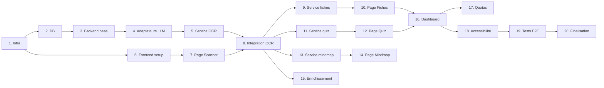

# Plan d'implémentation - Révise mieux MVP

## Checklist de progression

- [ ] **Étape 1** : Configuration du projet et infrastructure
- [ ] **Étape 2** : Base de données et migrations
- [ ] **Étape 3** : Backend - Structure de base et health checks
- [ ] **Étape 4** : Adaptateurs LLM (OpenAI + Mistral)
- [ ] **Étape 5** : Service OCR et endpoint
- [ ] **Étape 6** : Frontend - Setup React/Vite/Tailwind
- [ ] **Étape 7** : Frontend - Page Scanner avec upload
- [ ] **Étape 8** : Intégration OCR bout-en-bout
- [ ] **Étape 9** : Service génération de fiches
- [ ] **Étape 10** : Frontend - Page Fiches
- [ ] **Étape 11** : Service génération de quiz
- [ ] **Étape 12** : Frontend - Page Quiz interactive
- [ ] **Étape 13** : Service génération de mindmaps
- [ ] **Étape 14** : Frontend - Page Mindmap avec react-flow
- [ ] **Étape 15** : Service enrichissement (ressources)
- [ ] **Étape 16** : Dashboard et statistiques
- [ ] **Étape 17** : Gestion des quotas
- [ ] **Étape 18** : Accessibilité (WCAG 2.1 AA)
- [ ] **Étape 19** : Tests E2E
- [ ] **Étape 20** : Documentation et finalisation

---

## Étape 1 : Configuration du projet et infrastructure

### Objectif
Mettre en place l'environnement de développement complet avec Docker Compose.

### Implémentation
1. Mettre à jour `docker-compose.yml` pour les trois services (db, backend, frontend)
2. Créer/mettre à jour les Dockerfiles backend et frontend
3. Configurer le `.env.example` avec toutes les variables nécessaires
4. Mettre à jour le `Makefile` avec les commandes de dev

### Tests
- `make dev` démarre tous les services sans erreur
- Les trois containers sont healthy
- Les ports 3000, 8080, 5432 sont accessibles

### Démo
- Lancer `make dev` et voir les trois services démarrer
- Accéder à http://localhost:3000 (frontend placeholder)
- Accéder à http://localhost:8080/health (backend OK)

---

## Étape 2 : Base de données et migrations

### Objectif
Créer le schéma de base de données complet avec système de migrations.

### Implémentation
1. Installer golang-migrate ou écrire un système de migration simple
2. Créer les fichiers de migration SQL :
   - `001_create_cours.sql`
   - `002_create_fiches.sql`
   - `003_create_quiz.sql`
   - `004_create_mindmaps.sql`
   - `005_create_ressources.sql`
   - `006_create_activites.sql`
   - `007_create_quotas.sql`
3. Ajouter les index de performance
4. Ajouter commande `make db-migrate` au Makefile

### Tests
- Test unitaire : connexion à la base
- Test : migrations s'exécutent sans erreur
- Test : rollback fonctionne

### Démo
- Exécuter `make db-migrate`
- Vérifier les tables créées avec `psql` ou pgAdmin
- Montrer le schéma avec `\dt` et `\d cours`

---

## Étape 3 : Backend - Structure de base et health checks

### Objectif
Restructurer le backend avec Gin et l'architecture en couches.

### Implémentation
1. Ajouter Gin au `go.mod`
2. Restructurer `cmd/serveur/main.go` avec Gin
3. Créer `internal/config/config.go` pour la configuration
4. Créer `internal/api/routes.go` pour le routing
5. Créer `internal/api/middleware.go` (CORS, logging, recovery)
6. Implémenter les handlers health et statut
7. Créer `internal/store/postgres.go` pour la connexion DB

### Tests
- Test unitaire : parsing de la configuration
- Test d'intégration : GET /health retourne 200
- Test d'intégration : GET /api/statut retourne l'état de la DB

### Démo
- Appeler `curl http://localhost:8080/health`
- Appeler `curl http://localhost:8080/api/statut` et voir le statut DB
- Montrer les logs structurés dans la console

---

## Étape 4 : Adaptateurs LLM (OpenAI + Mistral)

### Objectif
Implémenter le pattern adaptateur pour les fournisseurs LLM avec fallback.

### Implémentation
1. Créer `internal/llm/adaptateur.go` avec l'interface
2. Créer `internal/llm/openai.go` :
   - Client OpenAI avec gestion des erreurs
   - Méthode `GenererTexte`
   - Méthode `GenererJSON` avec structured outputs
   - Méthode `ExtraireTexteImage` pour l'OCR
3. Créer `internal/llm/mistral.go` (même interface)
4. Créer `internal/llm/manager.go` pour le fallback automatique
5. Tests avec mocks

### Tests
- Test unitaire : mock de l'adaptateur
- Test d'intégration (optionnel, coûteux) : appel réel à OpenAI
- Test : fallback vers Mistral si OpenAI échoue

### Démo
- Appeler l'adaptateur OpenAI avec un prompt simple
- Simuler une erreur OpenAI et montrer le fallback Mistral
- Afficher les logs de retry/fallback

---

## Étape 5 : Service OCR et endpoint

### Objectif
Implémenter l'OCR complet avec extraction PDF et score de confiance.

### Implémentation
1. Créer `internal/services/ocr.go` :
   - Validation des fichiers (type, taille)
   - Extraction des pages PDF (lib pdfcpu)
   - Appel à l'adaptateur LLM pour l'OCR
   - Parsing des zones incertaines
2. Créer `internal/api/handlers_ocr.go` :
   - Handler multipart pour upload
   - Validation et réponse JSON
3. Créer `internal/store/cours_repo.go` :
   - CRUD pour les cours
4. Intégrer le tout dans les routes

### Tests
- Test unitaire : validation des fichiers
- Test unitaire : parsing du résultat OCR
- Test d'intégration : upload d'image → texte extrait
- Test d'intégration : upload PDF multi-pages

### Démo
- Uploader une image de notes via curl/Postman
- Voir le texte extrait avec les zones incertaines
- Vérifier que le cours est sauvegardé en base

---

## Étape 6 : Frontend - Setup React/Vite/Tailwind

### Objectif
Migrer le frontend vers React avec le design system existant.

### Implémentation
1. Initialiser le projet Vite + React + TypeScript
2. Configurer Tailwind avec le design system (couleurs, fonts)
3. Installer les dépendances (react-router-dom, etc.)
4. Créer la structure de dossiers (components, pages, services, etc.)
5. Créer les composants de base :
   - `Layout.tsx` avec Sidebar
   - `AccessibiliteControles.tsx`
6. Configurer le proxy API dans vite.config.ts
7. Créer `services/api.ts` pour les appels fetch

### Tests
- Test : `npm run dev` démarre sans erreur
- Test : les fonts et couleurs sont correctement appliquées
- Test composant : Layout s'affiche correctement

### Démo
- Accéder à http://localhost:3000
- Voir le layout avec la sidebar
- Tester les contrôles d'accessibilité (taille texte)

---

## Étape 7 : Frontend - Page Scanner avec upload

### Objectif
Créer la page de scan avec upload drag-and-drop et preview.

### Implémentation
1. Créer `pages/Scanner.tsx`
2. Créer les composants :
   - `ZoneUpload.tsx` (drag-drop, click, preview)
   - `PreviewFichiers.tsx` (grille de thumbnails)
   - `OptionsGeneration.tsx` (titre, matière, type de génération)
   - `IndicateurEtapes.tsx` (stepper)
3. Gérer l'état local (fichiers uploadés, options)
4. Préparer l'appel API (sans l'exécuter encore)

### Tests
- Test composant : ZoneUpload accepte les fichiers
- Test composant : preview affiche les thumbnails
- Test : validation du nombre de fichiers (max 10)

### Démo
- Naviguer vers /scanner
- Glisser-déposer des images
- Voir les previews et les options
- Supprimer un fichier de la liste

---

## Étape 8 : Intégration OCR bout-en-bout

### Objectif
Connecter le frontend au backend pour l'OCR complet.

### Implémentation
1. Créer `services/api.ts` avec la fonction `envoyerOCR()`
2. Ajouter l'état de chargement et progression
3. Créer `EditeurTexteOCR.tsx` :
   - Affichage du texte avec highlighting des zones incertaines
   - Édition inline
   - Bouton de validation
4. Créer `ProcessingSection.tsx` (animation de chargement)
5. Gérer les erreurs et afficher les messages

### Tests
- Test E2E : upload → processing → affichage texte
- Test : les zones incertaines sont highlightées
- Test : modification du texte et sauvegarde

### Démo
- Uploader une vraie photo de notes manuscrites
- Voir la progression de l'OCR
- Voir le texte extrait avec les zones jaunes (incertaines)
- Corriger une zone et valider

---

## Étape 9 : Service génération de fiches

### Objectif
Implémenter la génération de fiches de révision.

### Implémentation
1. Créer `internal/services/generation.go` :
   - Fonction `GenererFiches(coursID, options)`
   - Prompt optimisé pour fiches Q/R
   - Parsing du JSON structuré
2. Créer `internal/store/fiches_repo.go`
3. Créer `internal/api/handlers_generation.go` :
   - POST /api/generer/fiches
4. Ajouter l'endpoint aux routes

### Tests
- Test unitaire : parsing des fiches générées
- Test d'intégration : génération depuis un cours existant
- Test : les fiches sont sauvegardées en base

### Démo
- Après OCR, cliquer "Générer fiches"
- Voir les fiches créées en base
- Appeler GET /api/cours/{id}/fiches

---

## Étape 10 : Frontend - Page Fiches

### Objectif
Créer l'interface de révision avec les fiches.

### Implémentation
1. Créer `pages/Fiches.tsx`
2. Créer les composants :
   - `ListeFiches.tsx` (grille de cartes)
   - `CarteFiche.tsx` (flip card Q/R)
   - `ModeFichesRevision.tsx` (navigation une par une)
   - `FiltreDifficulte.tsx`
3. Appeler l'API pour charger les fiches
4. Implémenter le mode révision (flip, next, previous)

### Tests
- Test composant : CarteFiche flip au clic
- Test composant : navigation entre fiches
- Test : filtrage par difficulté

### Démo
- Naviguer vers /fiches
- Voir la liste des fiches d'un cours
- Entrer en mode révision
- Flip une carte, passer à la suivante

---

## Étape 11 : Service génération de quiz

### Objectif
Implémenter la génération de quiz configurables.

### Implémentation
1. Ajouter à `internal/services/generation.go` :
   - Fonction `GenererQuiz(coursID, nombreQuestions, difficulte)`
   - Prompt optimisé pour QCM avec explications
2. Créer `internal/store/quiz_repo.go`
3. Ajouter les endpoints :
   - POST /api/generer/quiz
   - POST /api/quiz/{id}/demarrer
   - POST /api/quiz/{id}/session/{sid}/repondre
   - POST /api/quiz/{id}/session/{sid}/terminer

### Tests
- Test unitaire : parsing du quiz généré
- Test d'intégration : création et session de quiz
- Test : calcul du score

### Démo
- Générer un quiz de 10 questions
- Voir le quiz en base avec les questions
- Simuler une session via API

---

## Étape 12 : Frontend - Page Quiz interactive

### Objectif
Créer l'expérience quiz complète avec feedback.

### Implémentation
1. Créer `pages/Quiz.tsx`
2. Créer les composants :
   - `ConfigurateurQuiz.tsx` (nombre, difficulté)
   - `QuestionQuiz.tsx` (énoncé + choix)
   - `FeedbackReponse.tsx` (correct/incorrect + explication)
   - `ResultatsQuiz.tsx` (score final, détail)
   - `ProgressionQuiz.tsx` (barre de progression)
3. Gérer l'état de la session (question courante, réponses)
4. Appeler l'API à chaque réponse

### Tests
- Test composant : sélection d'une réponse
- Test composant : affichage du feedback
- Test E2E : parcours quiz complet

### Démo
- Configurer un quiz (10 questions, moyen)
- Répondre aux questions
- Voir le feedback après chaque réponse
- Voir le score final avec détail

---

## Étape 13 : Service génération de mindmaps

### Objectif
Implémenter la génération de structure de mindmap.

### Implémentation
1. Ajouter à `internal/services/generation.go` :
   - Fonction `GenererMindmap(coursID)`
   - Prompt pour structure hiérarchique (nœuds + liens)
2. Créer `internal/store/mindmap_repo.go`
3. Ajouter l'endpoint POST /api/generer/mindmap
4. Format de sortie compatible react-flow

### Tests
- Test unitaire : parsing de la structure mindmap
- Test : structure valide pour react-flow

### Démo
- Générer une mindmap pour un cours
- Voir la structure JSON en réponse
- Vérifier en base

---

## Étape 14 : Frontend - Page Mindmap avec react-flow

### Objectif
Visualiser la mindmap de manière interactive.

### Implémentation
1. Installer react-flow
2. Créer `pages/Mindmap.tsx`
3. Créer les composants :
   - `VisualiseurMindmap.tsx` (canvas react-flow)
   - `NoeudPersonnalise.tsx` (style des nœuds)
   - `ControlesMindmap.tsx` (zoom, fit, export)
4. Convertir les données API vers le format react-flow
5. Implémenter l'export PNG/SVG

### Tests
- Test composant : rendu de la mindmap
- Test : zoom et pan fonctionnent
- Test : export génère une image

### Démo
- Naviguer vers /mindmap/{coursId}
- Voir la carte mentale interactive
- Zoomer, déplacer, collapse une branche
- Exporter en PNG

---

## Étape 15 : Service enrichissement (ressources)

### Objectif
Suggérer des ressources complémentaires via LLM.

### Implémentation
1. Ajouter à `internal/services/generation.go` :
   - Fonction `GenererRessources(coursID)`
   - Prompt pour suggestions (vidéos, articles, sites)
2. Créer `internal/store/ressources_repo.go`
3. Ajouter l'endpoint POST /api/generer/ressources
4. Frontend : afficher les ressources sur la page du cours

### Tests
- Test unitaire : parsing des ressources
- Test : ressources liées au bon cours

### Démo
- Générer des ressources pour un cours d'histoire
- Voir les suggestions (YouTube, Khan Academy, etc.)
- Avertissement affiché sur la vérification des liens

---

## Étape 16 : Dashboard et statistiques

### Objectif
Créer le tableau de bord avec statistiques globales.

### Implémentation
1. Créer `internal/services/statistiques.go` :
   - Compteurs (cours, fiches, quiz)
   - Score moyen
   - Activité récente
2. Ajouter les endpoints :
   - GET /api/statistiques
   - GET /api/activite
3. Créer `pages/Dashboard.tsx`
4. Créer les composants :
   - `StatistiquesCards.tsx`
   - `CoursRecents.tsx`
   - `ActiviteRecente.tsx`

### Tests
- Test : statistiques calculées correctement
- Test composant : affichage des stats

### Démo
- Page d'accueil avec statistiques
- Liste des cours récents avec progression
- Historique des dernières actions

---

## Étape 17 : Gestion des quotas

### Objectif
Implémenter les limites journalières configurables.

### Implémentation
1. Créer `internal/services/quotas.go` :
   - Vérification avant chaque opération
   - Incrémentation après succès
   - Reset automatique à minuit
2. Créer `internal/store/quotas_repo.go`
3. Ajouter middleware de vérification des quotas
4. Frontend : afficher le quota restant dans le header
5. Gérer l'erreur 429 côté frontend

### Tests
- Test : quota bloque après limite atteinte
- Test : reset à minuit
- Test : affichage frontend du quota

### Démo
- Configurer une limite basse (ex: 3)
- Faire 3 OCR
- Voir le message de limite atteinte
- Voir le quota dans le header

---

## Étape 18 : Accessibilité (WCAG 2.1 AA)

### Objectif
Implémenter toutes les fonctionnalités d'accessibilité.

### Implémentation
1. Créer `contexte/AccessibiliteContexte.tsx` :
   - État : taille texte, mode daltonien, contraste
   - Persistance localStorage
2. Mettre à jour `AccessibiliteControles.tsx`
3. Créer les classes Tailwind pour chaque mode
4. Ajouter les attributs ARIA sur tous les composants interactifs
5. Tester la navigation clavier
6. Vérifier les contrastes avec un outil

### Tests
- Test : changement de taille de texte appliqué
- Test : mode daltonien change la palette
- Test : navigation clavier complète
- Audit Lighthouse accessibilité > 90

### Démo
- Activer le mode contraste élevé
- Naviguer entièrement au clavier
- Montrer le score Lighthouse

---

## Étape 19 : Tests E2E

### Objectif
Couvrir les parcours critiques avec Playwright.

### Implémentation
1. Configurer Playwright
2. Créer les tests :
   - `parcours-ocr-fiches.spec.ts` : upload → OCR → génération fiches → révision
   - `parcours-quiz.spec.ts` : génération quiz → session complète → score
   - `parcours-mindmap.spec.ts` : génération → visualisation → export
   - `dashboard.spec.ts` : statistiques, navigation
3. Ajouter au CI GitHub Actions
4. Screenshots sur échec

### Tests
- Tous les tests E2E passent
- CI exécute les tests sur chaque PR

### Démo
- Lancer `npm run test:e2e`
- Voir les tests s'exécuter en headless
- Montrer le rapport HTML

---

## Étape 20 : Documentation et finalisation

### Objectif
Finaliser le projet pour utilisation.

### Implémentation
1. Mettre à jour le README.md :
   - Instructions d'installation
   - Configuration des clés API
   - Commandes disponibles
2. Vérifier tous les .env.example
3. Nettoyer le code (lint, format)
4. Vérifier les Dockerfiles de production
5. Créer un script de démo avec données de test
6. Tag version v0.1.0

### Tests
- Fresh clone + `make dev` fonctionne
- Documentation complète et à jour

### Démo
- Clone du repo sur une machine vierge
- `make dev` démarre tout
- Parcours complet : scan → fiches → quiz → mindmap

---

## Résumé des priorités

| Priorité | Étapes | Fonctionnalité |
|----------|--------|----------------|
| 1 | 1-5, 6-8 | OCR bout-en-bout |
| 2 | 9-10 | Génération de fiches |
| 3 | 11-12 | Quiz interactifs |
| 4 | 15-16 | Enrichissement + Dashboard |
| 5 | 13-14 | Mindmaps |
| - | 17-20 | Polish et qualité |

## Dépendances entre étapes

