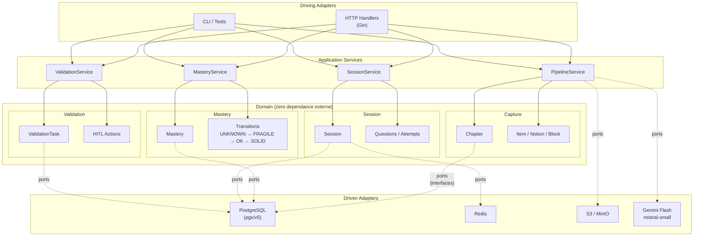

# Revise Mieux

Revise Mieux est un SaaS educatif qui transforme des photos de cahier en assistant de revision personnalise pour collegiens (11-15 ans). A partir d'un upload de cours, le produit genere une carte de lecon structuree, des entrainements adaptatifs avec repetition espacee, et met les parents dans la boucle via un reporting base sur des preuves de maitrise. Le projet est en phase Lot 0 (pre-MVP) avec 53 criteres d'acceptation sur 4 chapitres pilotes.

**Documentation complete** : [https://popul.github.io/ReviseMieux/](https://popul.github.io/ReviseMieux/)

---

## Stack technique

| Composant | Technologie |
|-----------|-------------|
| Backend API | Go 1.23 + Gin |
| Base de donnees | PostgreSQL 16 (pgx/v5, SQL brut) |
| Mobile | React Native + Expo 54 + Expo Router |
| LLM / OCR | Gemini Flash / mistral-small |
| Cache | Redis (go-redis/v9) |
| Storage | S3 / MinIO |

---

## Quick start

**Prerequis** : Go 1.23+, Node.js 20+, Docker (pour PostgreSQL + Redis + MinIO)

```bash
git clone https://github.com/popul/ReviseMieux.git
make setup
make dev
```

---

## Architecture

Monorepo `backend/` (Go) + `mobile/` (Expo), architecture hexagonale avec 4 bounded contexts DDD.



Le domaine definit les **ports** (interfaces). Les adaptateurs les implementent. Les dependances pointent toujours vers l'interieur.

---

## Etat du projet

| Metrique | Valeur |
|----------|--------|
| Tests backend | 326 |
| Tests mobile | 106 |
| Coverage backend | 44.7% |
| ACs Lot 0 | 53 (33 P1 + 20 P2) |

---

## Design system

Le design system interactif (HTML) est disponible dans le repo :

- Fichier : [`docs/design/design-system.html`](docs/design/design-system.html)
- En ligne : [https://popul.github.io/ReviseMieux/design/design-system.html](https://popul.github.io/ReviseMieux/design/design-system.html)

---

## Commandes utiles

| Commande | Description |
|----------|-------------|
| `make test` | Lancer tous les tests (backend + mobile) |
| `make dev` | Demarrer l'environnement de developpement |
| `make docs-serve` | Servir la documentation localement |
| `/feedback-loop` | Cycle autonome Claude Code : fix CI + feedback |
| `/sprint` | Cycle autonome : selection issue -> implementation -> CI |
| `/backlog` | Gestion du backlog GitHub Issues |

---

## Documentation

| Document | Description |
|----------|-------------|
| [PRD](docs/PRD.md) | Product Requirements Document complet |
| [MVP Scope](docs/MVP-scope.md) | 171 ACs classifies, perimetre Lot 0 |
| [Lot 0 Tracker](docs/lot0-tracker.md) | Suivi d'implementation |
| [Criteres d'acceptation](docs/ac/README.md) | 171 ACs en Given/When/Then (8 zones) |
| [Decisions UX](docs/ux/open-decisions.md) | Decisions produit documentees |
| [CLAUDE.md](CLAUDE.md) | Conventions et regles de developpement |

---

## Licence

MIT
