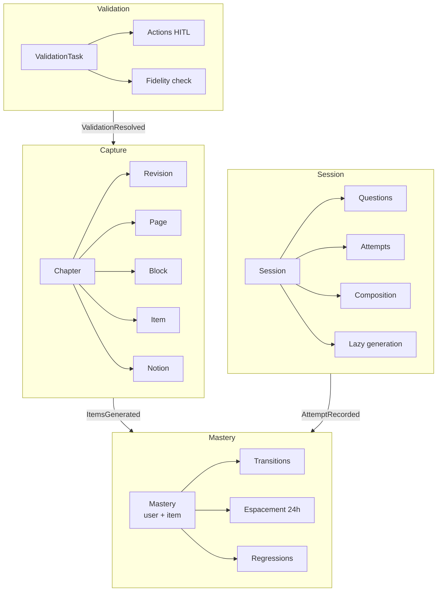
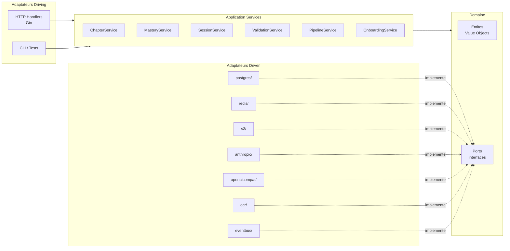

# Architecture -- Vue d'ensemble

Revise Mieux suit une architecture **hexagonale** (Ports & Adapters) avec un decoupage en **Domain-Driven Design** (DDD). Le domaine metier est au centre, protege de toute dependance technique par des interfaces (ports) et des implementations concretes (adaptateurs).

---

## Bounded Contexts

Le domaine se decompose en 4 contextes bornes, chacun avec son agregat racine :



### Interactions inter-contextes

Les transitions entre bounded contexts passent par des **domain events**, jamais par des appels directs :

| Event | Emetteur | Consommateur | Effet |
|-------|----------|-------------|-------|
| `ItemsGenerated` | Capture | Mastery | Creation des Mastery UNKNOWN pour chaque item |
| `AttemptRecorded` | Session | Mastery | Declenchement de la transition Mastery |
| `ValidationResolved` | Validation | Capture | Invalidation du cache questions |
| `ExamCreated` | Session | Mastery | Resserrement des intervalles d'espacement |

---

## Architecture hexagonale



### Regle fondamentale

Les dependances pointent **toujours vers l'interieur**. Le domaine n'importe rien du projet. Le wiring (injection des adaptateurs dans les services) se fait uniquement dans `cmd/server/main.go`.

---

## Structure des packages Go

```
backend/
├── cmd/server/main.go                # Point d'entree, wiring DI
├── internal/
│   ├── domain/                       # Coeur metier -- ZERO dependance externe
│   │   ├── chapter/                  # Agregat Chapter (+ Item, Notion, Block, Page, Revision)
│   │   ├── mastery/                  # Entite Mastery, transitions, value objects
│   │   ├── session/                  # Agregat Session (+ Question, Attempt)
│   │   ├── validation/               # Agregat ValidationTask
│   │   └── event/                    # Domain events partages, Clock, IDGenerator
│   │
│   ├── app/                          # Application services (use cases, orchestration)
│   │   ├── chapter_service.go
│   │   ├── mastery_service.go
│   │   ├── session_service.go
│   │   ├── validation_service.go
│   │   ├── pipeline_service.go
│   │   └── onboarding_service.go
│   │
│   ├── infra/                        # Adaptateurs (implementations des ports)
│   │   ├── postgres/                 # Repositories pgx (chapter, mastery, session, validation)
│   │   ├── s3/                       # Storage objets (MinIO en dev)
│   │   ├── anthropic/                # Client LLM Anthropic
│   │   ├── openaicompat/             # Client LLM OpenAI-compatible (Gemini, Mistral)
│   │   ├── ocr/                      # Service OCR (Gemini Flash VLM)
│   │   └── eventbus/                 # Publication d'events (log publisher)
│   │
│   ├── http/                         # Couche HTTP (handlers Gin, middleware, DTOs)
│   │   ├── handler/                  # Handlers par domaine
│   │   ├── middleware/               # Auth JWT
│   │   ├── dto/                      # Request/Response structs
│   │   └── router.go                 # Configuration des routes
│   │
│   ├── db/                           # Pool pgx + runner de migrations
│   ├── config/                       # Configuration depuis env vars
│   └── docs/                         # Swagger auto-genere (swaggo)
│
├── migrations/                       # Fichiers SQL de migration (NNN_description.sql)
└── testdata/                         # Fixtures, golden files
```

### Sens des imports

| Package | Peut importer | Ne peut pas importer |
|---------|---------------|---------------------|
| `domain/` | Rien du projet (stdlib Go uniquement) | `app/`, `infra/`, `http/`, `config/` |
| `app/` | `domain/` | `infra/`, `http/` |
| `infra/` | `domain/` (implemente les interfaces) | `app/`, `http/` |
| `http/` | `app/`, `domain/` | `infra/` |
| `cmd/server/` | Tout (point de wiring) | -- |

---

## Ports (interfaces du domaine)

Les ports sont definis dans les packages `domain/` et implementes par les adaptateurs dans `infra/`.

### Bounded context Capture (chapter/)

| Port | Package | Description |
|------|---------|-------------|
| `chapter.Repository` | `domain/chapter/repository.go` | CRUD de l'agregat Chapter (+ Items, Notions, Pages, Blocks) |
| `chapter.Storage` | `domain/chapter/ports.go` | Upload et recuperation de fichiers (S3/MinIO) |
| `chapter.OCRService` | `domain/chapter/ports.go` | Extraction OCR depuis des images |
| `chapter.LLMService` | `domain/chapter/ports.go` | Structuration LLM (OCR blocks -> Items + Notions) |
| `chapter.FidelityChecker` | `domain/chapter/ports.go` | Verification croisee LLM de la fidelite des items |

### Bounded context Mastery

| Port | Package | Description |
|------|---------|-------------|
| `mastery.Repository` | `domain/mastery/repository.go` | Persistance des etats Mastery (par user + item) |

### Bounded context Session

| Port | Package | Description |
|------|---------|-------------|
| `session.Repository` | `domain/session/repository.go` | Persistance des sessions, questions, attempts |
| `session.Scorer` | `domain/session/scorer.go` | Scoring automatique des reponses texte (LLM) |

### Bounded context Validation

| Port | Package | Description |
|------|---------|-------------|
| `validation.Repository` | `domain/validation/repository.go` | Persistance des taches de validation HITL |

### Ports techniques partages (event/)

| Port | Package | Description |
|------|---------|-------------|
| `event.Publisher` | `domain/event/events.go` | Publication des domain events |
| `event.Clock` | `domain/event/clock.go` | Abstraction du temps (testabilite de l'espacement 24h) |
| `event.IDGenerator` | `domain/event/id.go` | Generation d'identifiants UUIDv7 |

---

## Adaptateurs

| Adaptateur | Package | Implemente | Technologie |
|------------|---------|-----------|-------------|
| `postgres.ChapterRepository` | `infra/postgres/` | `chapter.Repository` | pgx/v5 |
| `postgres.MasteryRepository` | `infra/postgres/` | `mastery.Repository` | pgx/v5 |
| `postgres.SessionRepository` | `infra/postgres/` | `session.Repository` | pgx/v5 |
| `postgres.ValidationRepository` | `infra/postgres/` | `validation.Repository` | pgx/v5 |
| `s3.Storage` | `infra/s3/` | `chapter.Storage` | AWS SDK S3 |
| `anthropic.Structurer` | `infra/anthropic/` | `chapter.LLMService` | Anthropic API |
| `openaicompat.Structurer` | `infra/openaicompat/` | `chapter.LLMService` | OpenAI-compatible (Gemini, Mistral) |
| `openaicompat.AnswerScorer` | `infra/openaicompat/` | `session.Scorer` | OpenAI-compatible |
| `ocr.GeminiOCR` | `infra/ocr/` | `chapter.OCRService` | Gemini Flash VLM |
| `eventbus.LogPublisher` | `infra/eventbus/` | `event.Publisher` | Logs (stdout) |
| `event.RealClock` | `domain/event/` | `event.Clock` | `time.Now()` |
| `event.UUIDv7Generator` | `domain/event/` | `event.IDGenerator` | `google/uuid` |

---

## Voir aussi

- [Decision table merge OCR/IDP](merge-decision-table.md)
- [Pipeline OCR/IDP incremental](ocr-idp-incremental.md)
- [PRD -- Architecture cible](../PRD.md#14-architecture-cible-mvp)
