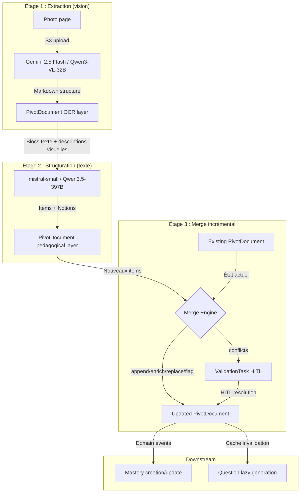
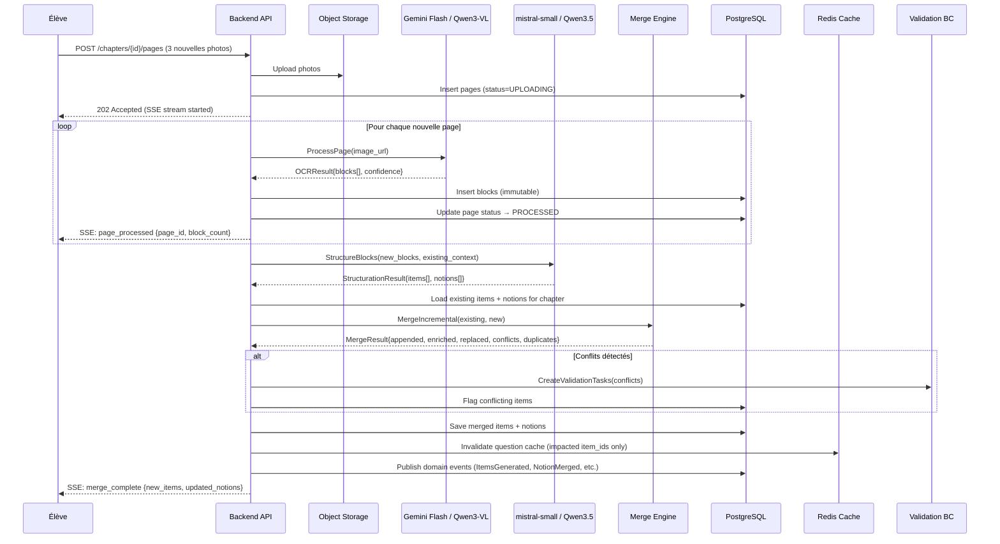

# Architecture OCR/IDP incrémental -- Révise Mieux

> Document d'architecture technique pour le pipeline d'ingestion incrémental de contenu scolaire.
> Dernière mise à jour : 2026-04-03.

---

## 1. Executive Summary

Révise Mieux ingère des photos de cahiers de collégiens pour en faire des assets de révision structurés. Le problème central n'est pas l'OCR lui-même -- c'est l'ingestion **incrémentale dans le temps** : un élève ajoute des pages jour après jour, re-photographie des pages floues, et complète son cours sur des semaines. Le système doit intégrer chaque batch sans régénérer le chapitre entier, tout en maintenant la cohérence des Notions, Items et Mastery existants.

Ce document définit : (1) un format pivot canonique entre OCR et LLM, (2) le workflow d'ingestion incrémentale en 10 étapes, (3) les règles de merge avec seuils concrets, (4) l'impact sur les Mastery existants, (5) l'intégration avec le bounded context Validation (HITL), et (6) les signatures Go et migrations SQL nécessaires.

**Modèles retenus** : Gemini 2.5 Flash (OCR, $0.001/page) + mistral-small ou Qwen3.5-397B (IDP, $0.00006-0.00011/item). Pipeline local viable via Qwen3-VL-32B + Gemma 3 27B ($0, ~2 min/chapitre).

---

## 2. Cadrage du problème

### 2.1 OCR éducatif vs. extraction documentaire générique

L'OCR/IDP éducatif diffère de l'extraction de factures ou de formulaires sur plusieurs axes fondamentaux :

| Dimension | IDP générique (factures) | IDP éducatif (cahiers) |
|-----------|--------------------------|------------------------|
| **Structure** | Champs fixes, positions connues | Structure libre, variable selon le prof |
| **Contenu** | Données factuelles (montants, dates) | Connaissances sémantiques (définitions, procédures, concepts) |
| **Visuels** | Logos, signatures (non pertinents) | Schémas porteurs de sens (cellule, circuit, carte) |
| **Manuscrit** | Rare (signatures) | Dominant (notes élève, corrections prof) |
| **Temporalité** | Document unique, ponctuel | Cours construit sur des semaines, incrémental |
| **Qualité cible** | Extraction exacte de champs | Compréhension sémantique pour générer des exercices |
| **Conséquence erreur** | Montant incorrect (corrigible) | Élève qui apprend une erreur (pédagogiquement dangereux) |

### 2.2 Ce qui rend l'ingestion incrémentale difficile

1. **Uploads partiels** : 3 pages lundi, 2 mercredi, 1 vendredi -- le cours est construit dans le temps.
2. **Pages dans le désordre** : l'élève photographie la page 5 avant la page 2.
3. **Contenu dupliqué** : re-photographie d'une page floue, ou même notion vue dans deux parties du cours.
4. **Contenu contradictoire** : corrections du prof qui contredisent la version initiale.
5. **Incertitude OCR variable** : confiance 0.95 sur du texte imprimé, 0.4 sur du manuscrit raturé.
6. **Schémas porteurs de sens** : un schéma de cellule sans son texte OCR perd 50% de sa valeur pédagogique.
7. **Traçabilité obligatoire** : chaque Item doit pouvoir pointer vers sa page source (Z2-AC13).
8. **Stabilité des identifiants** : les Notion IDs et Item IDs ne doivent pas changer quand de nouvelles pages arrivent.

### 2.3 Risques d'une architecture mal conçue

- **Fragmentation progressive** : le cours se décompose en sous-ensembles incohérents au fil des uploads.
- **Doublons Mastery** : un Item dupliqué produit deux Mastery indépendants pour la même connaissance.
- **Régression silencieuse** : un re-processing complet change les Item IDs, ce qui reset tous les Mastery.
- **Coût exponentiel** : re-traiter tout le chapitre à chaque ajout de page (O(n) au lieu de O(delta)).
- **Dérive pédagogique** : des Items contradictoires coexistent, l'élève étudie du contenu faux.

---

## 3. Architecture recommandée

### 3.1 Architecture 2 étages avec format pivot



### 3.2 Couches immutables vs mutables

Le format pivot sépare trois couches avec des règles de mutabilité distinctes :

| Couche | Mutabilité | Contenu | Justification |
|--------|-----------|---------|---------------|
| **Observations brutes** | **Immutable** | OCR text, bounding boxes, confiance, timestamps | Traçabilité. On ne modifie jamais ce que l'OCR a vu. |
| **Structure pédagogique** | **Mutable enrichissable** | Notions, Items, hiérarchie de sections | Enrichie quand de nouvelles pages arrivent. Les IDs sont stables. |
| **Outputs dérivés** | **Régénérable** | Questions, fiches, quiz, cache Redis | Invalidés et régénérés à la demande (lazy generation). |

**Principe** : les observations brutes (table `blocks`) ne sont jamais modifiées après création. Elles servent de "ground truth" pour la traçabilité. La structure pédagogique (tables `items`, `notions`) évolue par merge incrémental. Les outputs dérivés (table `questions`, cache Redis) sont invalidés et régénérés quand la structure change.

---

## 4. Design du format pivot canonique

### 4.1 Principes

1. **JSON** -- machine-friendly, inspectable, compatible avec tous les LLM.
2. **Enveloppe par Chapter** -- un PivotDocument = un Chapter complet à un instant t.
3. **Versionné** -- chaque mutation incrémente `pivot_version`.
4. **Traçable** -- chaque unité extraite pointe vers ses `source_refs` (Page ID + bbox).
5. **Confiance explicite** -- `confidence` sur chaque bloc et item, utilisée pour les décisions de merge.
6. **Compatible context windows** -- le pivot d'un chapitre de 10 pages tient dans ~8K tokens (compatible Gemma 3 27B, 128K context).

### 4.2 Structure du PivotDocument

Le PivotDocument n'est pas une table SQL séparée. C'est le **modèle conceptuel** qui décrit comment les tables existantes (`chapters`, `chapter_revisions`, `pages`, `blocks`, `items`, `notions`) s'articulent pour former une vue canonique du cours. Le JSON Schema (voir `pivot-format-schema.json`) décrit cette vue pour le debugging, les tests, et l'export.

Les tables SQL existantes restent la source de vérité. Le PivotDocument est une **projection** assemblée à la demande.

### 4.3 Sections du pivot

```
PivotDocument
├── metadata (chapter_id, subject, class_level, title, pivot_version, updated_at)
├── capture_sessions[] (immutable)
│   ├── revision_id, captured_at
│   └── pages[]
│       ├── page_id, page_order, photo_url, ocr_status, ocr_confidence
│       └── blocks[] (immutable observations)
│           ├── block_id, block_type, ocr_text, confidence, bbox
│           └── visual_metadata? (labels, table_structure, caption)
├── notions[] (mutable, stable IDs)
│   ├── notion_id, name, concept_tags[], sort_order
│   └── items[]
│       ├── item_id, item_type, term, keywords[], steps[], confidence
│       ├── source_refs[] (page_id + block_ids → traçabilité)
│       ├── fidelity_score, validation_required, archived
│       └── merge_status (original | enriched | replaced | conflict)
└── merge_log[] (audit trail)
    ├── timestamp, action (append | enrich | replace | archive_dup | flag_conflict)
    ├── source_item_id, target_item_id?
    └── reason
```

---

## 5. JSON Schema et exemples

Voir les fichiers compagnons :
- `pivot-format-schema.json` -- JSON Schema complet
- `pivot-format-example-photosynthese.json` -- Exemple concret sur "La photosynthèse" avec 3 sessions de capture

---

## 6. Workflow d'ingestion incrémentale

### 6.1 Diagramme de séquence



### 6.2 Détail des 10 étapes

#### Étape 1 : Upload et stockage (S3 + pages table)

- **Toujours recalculé** : upload S3, création entrées `pages`.
- **Réutilisable** : rien (nouvelles pages).
- **Invalidé** : rien encore.

Les photos sont stockées dans S3 avec la clé `chapters/{chapter_id}/revisions/{revision_id}/pages/{page_order}.webp`. Les métadonnées sont insérées dans la table `pages` avec `ocr_status = UPLOADING`.

#### Étape 2 : Rattachement au Chapter existant

Les nouvelles pages sont rattachées à la Revision courante du Chapter (Z2-AC14 : pas de nouvelle Revision pour un ajout incrémental). L'`page_order` continue depuis le dernier numéro existant.

- **Réutilisé** : le Chapter et la Revision existants.
- **Invalidé** : rien.

#### Étape 3 : OCR / analyse de layout (VLM page entière)

Chaque page est envoyée au VLM (Gemini 2.5 Flash en API, Qwen3-VL-32B en local) qui produit du Markdown structuré avec descriptions des visuels.

- **Toujours recalculé** : OCR sur les nouvelles pages uniquement (Z2-AC14).
- **Réutilisé** : les résultats OCR des pages existantes (jamais re-OCRisées).
- **Invalidé** : rien encore.

#### Étape 4 : Extraction de blocs (table `blocks`)

Les blocs OCR sont insérés dans la table `blocks`. Ils sont **immutables** après insertion.

- **Toujours recalculé** : parsing du Markdown OCR en blocs structurés.
- **Réutilisé** : blocs des pages existantes.
- **Invalidé** : rien.

#### Étape 5 : Structuration pédagogique (LLM IDP)

Le LLM de structuration (mistral-small / Qwen3.5-397B) reçoit les blocs des nouvelles pages **plus** un résumé du contexte existant (noms des Notions existantes, termes des Items existants) pour assurer la cohérence.

```
Prompt IDP enrichi (mode incrémental) :
  - System: instructions d'extraction + schéma JSON
  - Context: "Ce chapitre contient déjà les notions : [liste]. Items existants : [termes]."
  - Input: blocs OCR des nouvelles pages
  - Output: nouveaux items + rattachement aux notions existantes ou nouvelles
```

- **Toujours recalculé** : structuration des nouveaux blocs.
- **Réutilisé** : items et notions existants (fournis en contexte, pas re-générés).
- **Invalidé** : rien directement.

#### Étape 6 : Matching avec les structures existantes

Le Merge Engine compare les nouveaux items avec les existants en utilisant :
1. `CanonicalKey(term, item_type, pack_id)` -- matching exact (identité.go existant).
2. Similarité cosinus sur les keywords (Jaccard > 0.7) -- matching sémantique léger.
3. Confiance relative -- pour décider append vs replace.

Voir la section 7 (Règles de merge) pour les seuils détaillés.

#### Étape 7 : Merge / append / split / gestion de conflits

Le résultat du merge produit 6 types d'actions possibles (voir `merge-decision-table.md`).

- **Toujours recalculé** : la comparaison nouveaux vs existants.
- **Réutilisé** : les Items existants non impactés restent inchangés.
- **Invalidé** : cache Redis des questions pour les items modifiés/enrichis.

#### Étape 8 : Review basée sur la confiance (HITL)

Les items avec `merge_status = conflict` ou `confidence < 0.5` génèrent des `ValidationTask` dans le bounded context Validation.

- `source = 'coherence_check'` pour les contradictions (Z3-AC11).
- `source = 'fidelity_check'` pour les items de faible fidélité (Z3-AC10).

#### Étape 9 : Invalidation ciblée du cache

Seules les questions liées aux items impactés sont invalidées (Z3-AC07 : invalidation ciblée, pas globale).

```
Redis keys invalidated:
  questions:item:{item_id}  -- pour chaque item modifié/enrichi/remplacé
```

Les questions des items non impactés restent en cache (TTL 24h inchangé).

#### Étape 10 : Publication des domain events

| Event | Condition | Consommateurs |
|-------|-----------|---------------|
| `ItemsGenerated` | Nouveaux items créés (append) | Mastery BC (crée Mastery UNKNOWN) |
| `ItemsEnriched` | Items existants enrichis | Cache invalidation |
| `ItemArchived` | Doublon détecté et archivé | Mastery BC (transfert) |
| `ConflictDetected` | Contradiction entre items | Validation BC (crée ValidationTask) |
| `NotionMerged` | Nouvelle notion fusionnée avec existante | UI refresh |
| `BatchProcessed` | Fin du traitement incrémental | SSE notification élève |

---

## 7. Règles de merge / résolution de conflits

Voir `merge-decision-table.md` pour le tableau complet avec seuils.

### 7.1 Résumé des règles

| Situation | Action | Seuil | Automatique ? |
|-----------|--------|-------|---------------|
| Nouveau concept | **Append** | Aucun match (CanonicalKey miss + Jaccard < 0.5) | Oui |
| Même terme, détails supplémentaires | **Enrich** | CanonicalKey match + new keywords not in existing | Oui |
| Même terme, meilleure confiance | **Replace** | CanonicalKey match + `new.confidence > old.confidence + 0.15` | Oui |
| Même terme, définitions contradictoires | **Flag conflict** | CanonicalKey match + fidelity check contradiction | Non (HITL) |
| Même terme + même keywords | **Mark duplicate** | CanonicalKey match + Jaccard(keywords) > 0.85 | Oui (archive lower confidence) |
| Terme proche mais pas identique | **Create alternative** | Jaccard(keywords) 0.5-0.85 + terms differ | Non (HITL si confidence < 0.7) |

---

## 8. Continuité du cours dans le temps

### 8.1 Heuristiques de classification des nouvelles pages

Quand de nouvelles pages arrivent, le système doit déterminer leur nature :

| Classification | Heuristique | Action |
|----------------|-------------|--------|
| **Enrichissement du même cours** | Même `chapter_id` (explicite par l'élève via Z5-AC11) | Merge incrémental |
| **Re-photographie** | Similarité OCR > 0.8 avec une page existante du même chapitre | Proposer remplacement si meilleure confiance |
| **Fiche de correction** | Détection de mots-clés : "correction", "exercice", "corrigé" + contexte temporal post-cours | Tag `is_correction = true`, items type PROCEDURE |
| **Doublon inter-session** | Même CanonicalKey que des items existants | Merge automatique (archive le doublon) |
| **Enrichissement tardif** | Upload > 7 jours après le dernier, même chapitre | Merge incrémental + notification "Chapitre mis à jour" |

### 8.2 Points de validation humaine

Le système demande confirmation à l'élève quand :
1. Une page ressemble fortement à une page existante (similarité > 0.8) : "Cette page ressemble à la page 3 existante. Remplacer ou ajouter ?"
2. Le contenu semble appartenir à un autre chapitre (LLM detect subject mismatch) : "Ce contenu parle de [sujet]. L'ajouter à [chapitre actuel] ou créer un nouveau chapitre ?"
3. Plus de 30 jours entre le dernier upload et le nouveau : "Ce chapitre n'a pas été mis à jour depuis [N] jours. Ajouter des pages ou créer un nouveau chapitre ?"

### 8.3 Stabilité des Notion IDs

Les Notion IDs sont **persistants**. Quand de nouvelles pages arrivent :
- Le LLM IDP reçoit les noms des Notions existantes en contexte.
- S'il produit un item qui correspond à une Notion existante, il rattache l'item à cette Notion (par nom).
- Si l'item relève d'un concept nouveau, une nouvelle Notion est créée.
- Les Notion IDs ne changent jamais. Les noms de Notions peuvent être enrichis (ex: "Photosynthèse" -> "Photosynthèse et respiration cellulaire") si le contenu ajouté justifie un élargissement.

---

## 9. Impact sur les Mastery

### 9.1 Tableau de décision

| Événement | Impact Mastery | Domain event | Justification |
|-----------|---------------|--------------|---------------|
| **Nouvel Item** (append) | Mastery créé à UNKNOWN | `ItemsGenerated` | Nouveau contenu = nouvelle compétence à acquérir |
| **Item enrichi** (enrich) | Mastery **inchangé** | `ItemsEnriched` | L'item reste le même, il est juste plus complet. Le Mastery reflète la maîtrise du concept, pas du détail. |
| **Item remplacé** (replace) | Mastery **transféré** de l'ancien vers le nouveau | `ItemReplaced` | L'ancien item est archivé. Le Mastery est conservé car le concept est le même, seule la formulation change. |
| **Item archivé** (doublon) | Mastery du doublon **transféré** vers l'item survivant (Z3-AC11) | `ItemArchived` | Le Mastery le plus avancé (state + consecutive_successes) est conservé. |
| **Item splitté** | Mastery de l'item source **copié** vers les deux items résultants, rétrogradé de 1 niveau | `ItemSplit` | Le split crée de l'incertitude : l'élève maîtrisait le concept global mais pas nécessairement les deux sous-concepts. |
| **Conflit détecté** | Mastery **gelé** (pas de transition) tant que non résolu | `ConflictDetected` | Un item sous investigation ne doit pas progresser (Z3-AC12). |

### 9.2 Transfert de Mastery

```go
// TransferMastery transfers mastery state from a source item to a target item.
// If both have masteries, the more advanced state is kept.
// Used when archiving duplicates (Z3-AC11) or replacing items.
func (s *MasteryService) TransferMastery(ctx context.Context, sourceItemID, targetItemID uuid.UUID) error
```

Règles de transfert :
- Si seul le source a un Mastery -> transfert direct.
- Si les deux ont un Mastery -> on conserve le plus avancé (SOLID > OK > FRAGILE > UNKNOWN).
- À état égal, on conserve celui avec le plus de `consecutive_successes`.
- Le Mastery source est soft-deleted (conservé pour audit).

---

## 10. Workflow de review humaine (HITL)

### 10.1 Intégration avec ValidationTask

Le pipeline incrémental crée des `ValidationTask` dans les cas suivants :

| Cas | `source` | `priority` | Résolution |
|-----|----------|-----------|------------|
| Contradiction entre items (Z3-AC11) | `coherence_check` | HIGH | Élève/parent choisit la bonne version |
| Fidelity score < 0.5 (Z3-AC10) | `fidelity_check` | MEDIUM | Confirmer/corriger l'item |
| Re-photographie ambiguë | `merge_conflict` | LOW | Confirmer remplacement ou ajout |
| Merge incertain (Jaccard 0.5-0.7) | `merge_conflict` | LOW | Confirmer fusion ou séparation |

### 10.2 Seuils de confiance pour HITL

```
confidence >= 0.85 → Pas de HITL (Z3-AC09)
confidence 0.50-0.84 → Item utilisable, gabarits simples uniquement (Z3-AC01)
confidence < 0.50 → HITL obligatoire, item en attente
OCR confidence < 0.30 → Page marquée BLURRY (Z2-AC03), suggestion re-photographie
```

### 10.3 File de validation

La file respecte la contrainte Z2-AC09 (max 8 items) :
- Les items les plus impactants (proches d'un exam, état FRAGILE) sont priorisés.
- Les items de merge incrémental ont une priorité inférieure aux items de premier pipeline.
- Le parent en mode actif reçoit max 3 items/semaine (Z3-AC08).

---

## 11. Impact sur la génération downstream

### 11.1 Invalidation ciblée

Quand le merge incrémental modifie des items :

| Action merge | Questions impactées | Invalidation |
|-------------|--------------------|----|
| **Append** (nouvel item) | Aucune existante | Pas d'invalidation. Nouvelles questions générées lazy. |
| **Enrich** (item enrichi) | Questions de cet item | Invalidation `questions:item:{id}`. Régénération lazy. |
| **Replace** | Questions de l'ancien item | Invalidation. L'ancien item est archivé, nouvelles questions sur le nouveau. |
| **Archive dup** | Questions du doublon archivé | Invalidation. Questions du survivant inchangées. |
| **Conflict** | Questions des deux items | Invalidation. Gabarits restreints (Z3-AC01) en attendant résolution. |

### 11.2 Articulation avec le bounded context Session

Le Session BC consomme les items via le port `chapter.Repository.FindItemsByChapter()`. Les items archivés sont filtrés (`WHERE NOT archived`). Les items en conflit sont restreints aux gabarits simples. Le Session BC n'a pas besoin de connaître le format pivot -- il opère sur les entités `Item` et `Notion` existantes.

---

## 12. Signatures Go des méthodes domaine

### 12.1 Nouveaux domain events

```go
// backend/internal/domain/event/events.go

// ItemsEnriched is emitted when existing items are enriched with new content.
type ItemsEnriched struct {
    BaseEvent
    ChapterID uuid.UUID
    ItemIDs   []uuid.UUID
}

func (e ItemsEnriched) EventName() string { return "items.enriched" }

// ItemReplaced is emitted when an item is replaced by a better extraction.
type ItemReplaced struct {
    BaseEvent
    ChapterID    uuid.UUID
    OldItemID    uuid.UUID
    NewItemID    uuid.UUID
    Reason       string // "higher_confidence", "re_photograph"
}

func (e ItemReplaced) EventName() string { return "item.replaced" }

// ItemArchived is emitted when a duplicate item is archived.
type ItemArchived struct {
    BaseEvent
    ChapterID    uuid.UUID
    ArchivedID   uuid.UUID
    SurvivorID   uuid.UUID
}

func (e ItemArchived) EventName() string { return "item.archived" }

// ConflictDetected is emitted when contradictory items are found.
type ConflictDetected struct {
    BaseEvent
    ChapterID uuid.UUID
    ItemIDs   []uuid.UUID
    Reason    string // "contradiction", "ambiguous_merge"
}

func (e ConflictDetected) EventName() string { return "conflict.detected" }

// NotionMerged is emitted when a new notion is merged into an existing one.
type NotionMerged struct {
    BaseEvent
    ChapterID    uuid.UUID
    SourceID     uuid.UUID
    TargetID     uuid.UUID
}

func (e NotionMerged) EventName() string { return "notion.merged" }

// BatchProcessed is emitted when an incremental batch finishes processing.
type BatchProcessed struct {
    BaseEvent
    ChapterID   uuid.UUID
    RevisionID  uuid.UUID
    PageIDs     []uuid.UUID
    NewItems    int
    Enriched    int
    Conflicts   int
}

func (e BatchProcessed) EventName() string { return "batch.processed" }
```

### 12.2 Merge Engine (domain service)

```go
// backend/internal/domain/chapter/merge.go

// MergeAction represents the type of merge operation performed.
type MergeAction string

const (
    MergeAppend      MergeAction = "APPEND"
    MergeEnrich      MergeAction = "ENRICH"
    MergeReplace     MergeAction = "REPLACE"
    MergeFlagConflict MergeAction = "FLAG_CONFLICT"
    MergeArchiveDup  MergeAction = "ARCHIVE_DUP"
    MergeCreateAlt   MergeAction = "CREATE_ALT"
)

// MergeDecision represents a single merge decision for one item.
type MergeDecision struct {
    Action       MergeAction
    NewItem      *StructuredItem
    ExistingItem *Item      // nil for APPEND
    Confidence   float32
    Reason       string
}

// MergeResult holds the complete result of an incremental merge operation.
type MergeResult struct {
    Appended  []*Item
    Enriched  []*Item
    Replaced  []ItemReplacement
    Archived  []ItemArchival
    Conflicts []ItemConflict
}

// ItemReplacement records a replacement decision.
type ItemReplacement struct {
    OldItem *Item
    NewItem *Item
    Reason  string
}

// ItemArchival records a duplicate archival.
type ItemArchival struct {
    Archived *Item
    Survivor *Item
}

// ItemConflict records a detected conflict requiring HITL.
type ItemConflict struct {
    Items  []*Item
    Reason string // "contradiction", "ambiguous_merge"
}

// MergeEngine performs incremental merge of new items into existing chapter content.
// It is a pure domain service with no infrastructure dependencies.
type MergeEngine struct{}

// NewMergeEngine creates a new MergeEngine.
func NewMergeEngine() *MergeEngine {
    return &MergeEngine{}
}

// MergeIncremental compares new structured items against existing items
// and produces merge decisions.
// existing: current items in the chapter (non-archived).
// incoming: newly extracted items from the IDP stage.
// packID: optional pack identifier for canonical key computation.
func (m *MergeEngine) MergeIncremental(
    existing []*Item,
    incoming []StructuredItem,
    packID *string,
) *MergeResult
```

### 12.3 Enhanced LLMService port

```go
// backend/internal/domain/chapter/ports.go (extended)

// LLMService is the port for LLM-based structuration.
type LLMService interface {
    // StructureBlocks takes OCR text blocks and produces structured items and notions.
    StructureBlocks(ctx context.Context, subject string, blocks []OCRBlock) (*StructurationResult, error)

    // StructureBlocksIncremental takes OCR text blocks and existing context
    // to produce structured items aligned with existing notions.
    StructureBlocksIncremental(
        ctx context.Context,
        subject string,
        newBlocks []OCRBlock,
        existingNotions []string,       // names of existing notions
        existingTerms []string,          // terms of existing items
    ) (*StructurationResult, error)
}

// CoherenceChecker is the port for detecting contradictions between items (Z3-AC11).
type CoherenceChecker interface {
    // CheckCoherence compares new items against existing items for contradictions.
    CheckCoherence(
        ctx context.Context,
        existingItems []*Item,
        newItems []*Item,
    ) ([]CoherenceIssue, error)
}

// CoherenceIssue represents a detected coherence problem.
type CoherenceIssue struct {
    Type     string    // "contradiction", "duplicate"
    ItemIDs  []uuid.UUID
    Detail   string
    Severity float32   // 0.0-1.0
}
```

### 12.4 Application service orchestration

```go
// backend/internal/app/pipeline_service.go (extended)

// ProcessIncrementalBatch orchestrates the incremental pipeline for new pages.
// It is the main entry point for Z2-AC14.
func (s *PipelineService) ProcessIncrementalBatch(
    ctx context.Context,
    chapterID uuid.UUID,
    pageIDs []uuid.UUID,
) (*event.BatchProcessed, error)

// The method:
// 1. Loads existing items and notions for the chapter
// 2. Runs OCR on new pages (ProcessPage per page)
// 3. Calls StructureBlocksIncremental with existing context
// 4. Runs MergeEngine.MergeIncremental
// 5. Runs CoherenceChecker.CheckCoherence (new vs existing only, Z2-AC14)
// 6. Runs FidelityChecker.CheckFidelity on new items
// 7. Creates ValidationTasks for conflicts and low-fidelity items
// 8. Saves merged results
// 9. Invalidates Redis cache for impacted items
// 10. Publishes domain events
```

---

## 13. Migrations SQL

### 13.1 Nouvelles colonnes

```sql
-- Migration: 003_incremental_merge.sql

-- Add merge tracking to items
ALTER TABLE items ADD COLUMN merge_status TEXT NOT NULL DEFAULT 'original'
    CHECK (merge_status IN ('original', 'enriched', 'replaced', 'conflict', 'alternative'));
ALTER TABLE items ADD COLUMN replaced_by_id UUID REFERENCES items(id);
ALTER TABLE items ADD COLUMN source_block_ids UUID[] NOT NULL DEFAULT '{}';

-- Add similarity tracking for deduplication
ALTER TABLE items ADD COLUMN canonical_key TEXT;
CREATE INDEX idx_items_canonical_key ON items(canonical_key) WHERE NOT archived;

-- Track which blocks contributed to which items (many-to-many)
CREATE TABLE item_source_blocks (
    item_id     UUID NOT NULL REFERENCES items(id) ON DELETE CASCADE,
    block_id    UUID NOT NULL REFERENCES blocks(id) ON DELETE CASCADE,
    PRIMARY KEY (item_id, block_id)
);
CREATE INDEX idx_item_source_blocks_block ON item_source_blocks(block_id);

-- Merge audit log
CREATE TABLE merge_log (
    id              UUID PRIMARY KEY,
    chapter_id      UUID NOT NULL REFERENCES chapters(id) ON DELETE CASCADE,
    action          TEXT NOT NULL CHECK (action IN ('append', 'enrich', 'replace', 'archive_dup', 'flag_conflict', 'create_alt')),
    source_item_id  UUID REFERENCES items(id),
    target_item_id  UUID REFERENCES items(id),
    reason          TEXT NOT NULL,
    confidence      REAL,
    created_at      TIMESTAMPTZ NOT NULL DEFAULT now()
);
CREATE INDEX idx_merge_log_chapter ON merge_log(chapter_id, created_at);

-- Page similarity tracking for re-photograph detection
ALTER TABLE pages ADD COLUMN text_fingerprint TEXT; -- hash of OCR text for quick similarity check
CREATE INDEX idx_pages_fingerprint ON pages(text_fingerprint) WHERE text_fingerprint IS NOT NULL;

-- Add processing_incremental status to revision_status enum
-- Note: PostgreSQL ALTER TYPE ADD VALUE is not transactional, must be separate
ALTER TYPE revision_status ADD VALUE IF NOT EXISTS 'PROCESSING_INCREMENTAL';
```

### 13.2 Backfill canonical keys

```sql
-- Migration: 004_backfill_canonical_keys.sql
-- Run once after deploying merge support.
-- Canonical keys are computed in Go and written back.
-- This migration adds a trigger placeholder; actual backfill is done by the Go migration job.

-- No-op SQL migration. Backfill is performed by:
-- go run cmd/migrate/backfill_canonical_keys.go
```

---

## 14. Risques et mitigations

| # | Risque | Impact | Probabilité | Mitigation |
|---|--------|--------|------------|------------|
| 1 | **Merge incorrect** : deux Items différents fusionnés car CanonicalKey identique | Perte de contenu, Mastery incohérent | Moyenne | Le merge est réversible (merge_log). Items archivés soft-delete. Fallback HITL. |
| 2 | **Conflit non détecté** : contradiction subtile non repérée par le LLM | Élève étudie du contenu faux | Faible (fidelity check catch) | Double filet : fidelity check (Z3-AC10) + détection anomalie par taux d'échec (Z3-AC13). |
| 3 | **Context window overflow** : chapitre très long (30+ pages) dépasse le contexte du LLM local | IDP tronqué, items manquants | Faible (Lot 0 = 4 chapitres pilotes) | Chunking par Notion. Résumé condensé du contexte existant (noms + termes, pas le texte complet). |
| 4 | **Latence merge** : le merge engine + coherence check ajoutent de la latence | UX dégradée lors de l'ajout de pages | Moyenne | Coherence check en async (batch). SSE progressive. Merge engine est CPU-bound, pas I/O. |
| 5 | **Drift OCR** : Gemini Flash change de version, qualité OCR fluctue | Items mal extraits | Moyenne | LLM versioning (Z2-AC13). Monitoring fidelity score. Alertes drift. |
| 6 | **Fragmentation Notion** : les Notions se multiplient au fil des uploads | Cours illisible, trop de Notions | Moyenne | Cap à 7 Notions/chapitre (Z7-AC15). Fusion automatique des Notions < 2 items. |

---

## 15. Stratégie d'implémentation : MVP vs évolution future

### Phase MVP (Lot 0)

**Scope** : Pipeline linéaire, pas de merge sophistiqué. Re-processing complet si ajout de pages.

| Composant | Implémentation |
|-----------|---------------|
| OCR | Gemini 2.5 Flash (API) ou Qwen3-VL-32B (local via Ollama) |
| IDP | mistral-small (API) ou Gemma 3 27B (local) |
| Merge | **Aucun**. Ajout de pages = re-run pipeline complet sur toutes les pages du chapitre. Items regénérés from scratch. |
| Dedup | CanonicalKey uniquement (matching exact sur term + type + pack). Archive automatique des doublons. |
| HITL | Fidelity check (Z3-AC10) + coherence basique (Z3-AC11, même terme contradictoire). |
| Mastery impact | Re-génération = nouveaux Item IDs = Mastery reset. Acceptable pour 4 chapitres pilotes. |
| Format pivot | Pas de PivotDocument formel. Les tables SQL existantes suffisent. |

**Coût** : re-processing de 10 pages = ~$0.02 (API) ou $0 (local). Acceptable pour le Lot 0.

### Phase V2 : Incrémental basique

| Composant | Implémentation |
|-----------|---------------|
| Merge | MergeEngine avec les 6 actions (append/enrich/replace/conflict/dup/alt) |
| IDP | `StructureBlocksIncremental` avec contexte existant |
| Dedup | CanonicalKey + Jaccard keywords (seuils documentés dans merge-decision-table.md) |
| Coherence | LLM coherence check (cross-page, nouveaux vs existants uniquement) |
| Mastery | Transfert de Mastery sur archive/replace. Gel sur conflit. |
| Merge log | Table `merge_log` pour audit et réversibilité |
| Format pivot | PivotDocument comme projection (pas de table dédiée) |

### Phase V3 : Knowledge graph éducatif

| Composant | Implémentation |
|-----------|---------------|
| Graphe de concepts | Relations typées entre Notions (prérequis, composition, analogie) |
| Résolution automatique | LLM agent pour résoudre les conflits mineurs sans HITL |
| Mémoire de cours | Historique complet des mutations avec undo/redo |
| Cross-chapter | Liens entre Items de chapitres différents de la même matière |
| Embeddings | Vecteurs sémantiques pour la recherche de similarité (pgvector) |

---

## 16. Recommandation finale

**Pour le Lot 0**, implémenter le pipeline linéaire simple (re-processing complet). Le coût est négligeable sur 4 chapitres pilotes et cela évite la complexité du merge.

**Dès la V2**, implémenter le `MergeEngine` avec les règles de merge documentées ici. C'est le point d'inflexion où l'expérience utilisateur change : l'élève peut ajouter des pages sans perdre sa progression.

**Le format pivot JSON Schema** doit être défini dès maintenant (il l'est dans ce document) car il contraint le contrat entre OCR et IDP. Même si le MVP ne fait pas de merge, le format pivot assure que les données sont structurées correctement pour le merge futur.

**Priorités d'implémentation** :
1. `CanonicalKey` (déjà implémenté dans `identity.go`)
2. `MergeEngine` (domaine pur, testable unitairement)
3. `StructureBlocksIncremental` (extension du port LLMService)
4. Migration SQL `003_incremental_merge.sql`
5. `ProcessIncrementalBatch` (orchestration dans app service)
6. Domain events (`ItemsEnriched`, `ItemReplaced`, `ItemArchived`, `ConflictDetected`)
7. Intégration HITL (ValidationTask pour conflits de merge)
